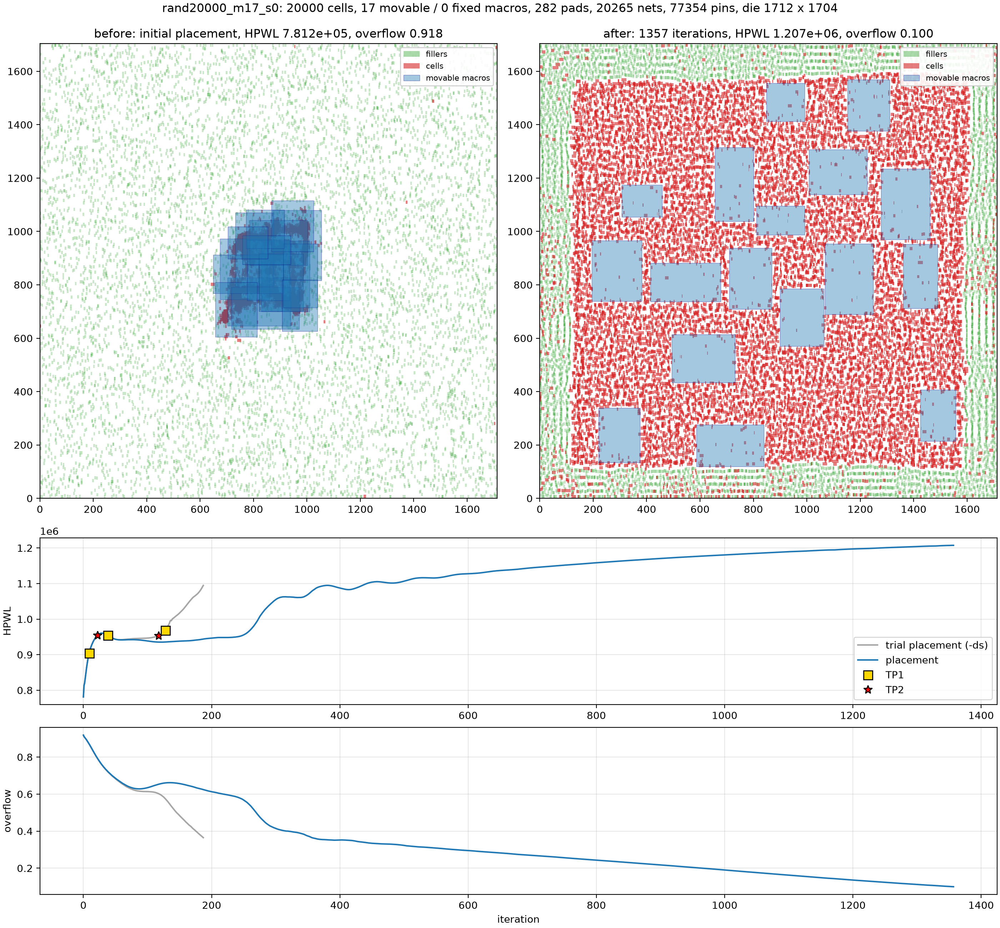

# RePlAce

A small, readable implementation of the RePlAce global placer
(Cheng, Kahng, Kang, Wang, *"RePlAce: Advancing Solution Quality and Routability
Validation in Global Placement"*, TCAD 2018; see `papers/replace.pdf`) in Python and PyTorch.

Scope: global placement only. The output is not legalized (cells may still
overlap slightly, macros may overlap) and there is no routability mode, since
both need tools outside RePlAce (a legalizer / detailed placer and a global router).

## Example output

Every placement run can write a figure like this one, produced by

    uv run replace place --cells 20000 --macros 17 --ds --plot docs/example

The design has 20,000 standard cells, 17 movable macros and 282 IO pads on
the die boundary, connected by about 20,000 nets.

- **Top left: before.** This is where the Nesterov optimization starts. The
  wirelength-only initial placement pulls all standard cells (red) and macros
  (blue) into one heavily overlapping clump near the die center, because
  overlap costs nothing yet. Fillers (green) are dummy cells that represent the
  whitespace, here 24% of the die. They start spread uniformly at random.
- **Top right: after.** This is the global placement result. The density
  penalty has pushed cells and macros apart until the cells cover their region
  almost uniformly at the target density (100%). Fillers are pushed to the
  periphery and take up the whitespace. The result is a *global* placement:
  cells are not snapped to rows and small overlaps remain. The run stops at
  overflow 0.10, i.e. when 10% of the cell area still sits in over-full bins.
- **HPWL curve.** HPWL is the half-perimeter wirelength, summed over all nets.
  It *rises* during the run, which is expected. The starting clump is the
  wirelength-optimal solution (low HPWL, overflow ≈ 0.9) but is physically
  meaningless. The placer minimizes `W + λ·D`, and the density penalty λ grows
  every iteration, so cells are increasingly pushed apart and nets stretch.
  Quality is judged by the *final* HPWL, the wirelength paid to remove the
  overlap; a better placer ends lower.
- **Overflow curve.** Overflow is the share of cell area in over-full bins. It
  falls from about 0.9 to the 0.10 stopping target.
- **`-ds` extras.** With dynamic step size adaptation, the gray curves are the
  short trial placement. On its HPWL curve, red stars mark the 2nd-order
  transition points (TP2) and yellow squares the 1st-order ones (TP1)
  (Section IV). The actual run (blue) then grows the density penalty more
  slowly, especially around the TP2s. It takes more iterations but ends with
  lower HPWL than the default run.

The benchmark (`uv run replace bench`) writes one such figure per design
and mode to `benchmarks/results/`.

## Algorithm

    min_v  f(v) = W(v) + λ·D(v)

| Piece | Module | Source |
|---|---|---|
| Netlist as flat tensors (objects, pins, nets) | `design.py` | |
| Exact HPWL and weighted-average (WA) wirelength `W` | `wirelength.py` | ePlace |
| Electrostatic density `D`: bin grid, fillers, local smoothing, spectral (DCT) Poisson solve, overflow | `density.py` | ePlace / ePlace-MS |
| Bound-to-bound quadratic initial placement solved with conjugate gradient | `initial.py` | RePlAce |
| Nesterov's method with Lipschitz step prediction and backtracking | `nesterov.py` | ePlace |
| Main loop: preconditioner, γ schedule, λ update (Alg. 2), stopping rule | `placer.py` | RePlAce |
| Dynamic step size adaptation `-ds`: trial placement, transition points (Alg. 3), cof_max schedule (Eq. 10) | `dynamic_step.py` | RePlAce |
| Local density function `-ld`: per-bin penalty ν_j (Eq. 2), per-object coefficient Δ_i (Eq. 3), gradient (Eq. 8, 9) | `density.py`, `placer.py` | RePlAce |
| Random benchmark generator | `generate.py` | |
| Plots, benchmark harness, CLI | `plot.py`, `bench.py`, `__init__.py` | |

Implementation notes:

- **Gradients:** the wirelength gradient comes from autograd. The density
  gradient is the ePlace electric force `q_i·E`, where the field `E` is computed
  spectrally per bin and averaged over the bins each object overlaps. It is
  plugged into autograd with a small custom `Function`, so the objective stays
  `W + λ·D`. Differentiating the bin density map directly would also be exact
  for the discretized energy, but that gradient jumps whenever an object edge
  crosses a bin boundary. That breaks Nesterov's Lipschitz step prediction, and
  placement then stalls at about 20% overflow.
- **Density map:** a rectangle's overlap with a bin factorizes into
  x-overlap × y-overlap. Standard cells and fillers use a 3×3 window of bins
  (span ≤ 2 bins, nearly all of them) or a 5×5 one (span ≤ 4); macros use dense
  overlaps with every bin (`ρ = Oxᵀ·Oy`).
- **DCT:** computed as products with precomputed M×M cosine/sine matrices.
- **Constants** not given in the paper are taken from ePlace and the open-source
  RePlAce and noted in comments: the γ schedule, cof ∈ [0.95, 1.05], the
  preconditioner `#pins + λ·area`, and filler sizing. ΔHPWL_ref (3.5e5 on ISPD
  designs) is rescaled to 0.075·#nets·bin width.
- **Initial λ:** λ₀ = 8e-3·|∇W|₁/|∇D|₁, 100× RePlAce's factor. With 8e-5,
  overflow stays flat for roughly the first 200 iterations while λ grows, unlike
  the paper's Fig. 5. `-ds` can also stall then: when its first, slowest phase
  covers that flat stretch, it never converges (seen on a 50k-cell design with
  large macros). With 8e-3, default runs need about 25% fewer iterations for
  the same HPWL (±0.1%).
- **Additions not in RePlAce:** after initial placement every movable object
  gets a random kick of up to half a bin. Quadratic placement puts cells with
  identical connectivity at exactly the same point, where their own density
  peak exerts no separating force.

### Dynamic step size adaptation (`-ds`)

A trial placement runs with the default λ schedule until the overflow drops
below 1/2.5 of its initial value, recording the HPWL curve. Algorithm 3
splits the curve into three phases at two 2nd-order transition points (TP2)
and finds one 1st-order transition point (TP1) in each phase. The actual
placement then caps λ's per-iteration growth at cof_max (Eq. 10). The cap is
smallest at the TP2s (phase minima 1.0001 / 1.001 / 1.005) and largest at the
TP1s (phase maxima 1.001 / 1.025 / 1.05).

The paper leaves some details open; these follow the original RePlAce code
(`trial.cpp`, `opt.cpp`):
- The phase boundaries, i.e. the trial's start and end points plus the TP2s,
  serve as the TP2 in Eq. 10. Which one depends on whether the current point is
  before or after the phase's TP1.
- The ratio in Eq. 10 is capped at 1.
- Progress through the phases is tracked by the density potential, which keeps
  decreasing even while HPWL is flat.
- After the trial's end point, cof_max stays at 1.005.

Constant step size scales vs `-ds` (cf. the paper's Fig. 7), from
`benchmarks/step_sweep.py`. HPWL is relative to cof_max = 1.10; iterations
for `-ds` include the trial.

| design | λ step range | HPWL | vs [0.95, 1.10] | iterations | time (s) |
|---|---|---|---|---|---|
| rand10000_m13_s0 | [0.95, 1.10] | 6.0941e+05 | +0.00% | 180 | 1.5 |
| rand10000_m13_s0 | [0.95, 1.05] (default) | 6.0581e+05 | -0.59% | 317 | 2.5 |
| rand10000_m13_s0 | [0.95, 1.02] | 6.0422e+05 | -0.85% | 730 | 5.5 |
| rand10000_m13_s0 | [0.95, 1.01] | 6.0400e+05 | -0.89% | 1416 | 10.7 |
| rand10000_m13_s0 | [0.95, 1.005] | 6.0385e+05 | -0.91% | 2788 | 20.9 |
| rand10000_m13_s0 | [0.95, 1.002] | 6.0377e+05 | -0.93% | 6898 | 51.4 |
| rand10000_m13_s0 | -ds | 6.0392e+05 | -0.90% | 1717 | 12.9 |
| rand50000_m23_s0 | [0.95, 1.10] | 3.1430e+06 | +0.00% | 186 | 6.9 |
| rand50000_m23_s0 | [0.95, 1.05] (default) | 3.1202e+06 | -0.72% | 325 | 13.3 |
| rand50000_m23_s0 | [0.95, 1.02] | 3.1046e+06 | -1.22% | 750 | 30.0 |
| rand50000_m23_s0 | [0.95, 1.01] | 3.1013e+06 | -1.32% | 1459 | 57.8 |
| rand50000_m23_s0 | [0.95, 1.005] | 3.1012e+06 | -1.33% | 2877 | 115.3 |
| rand50000_m23_s0 | [0.95, 1.002] | 3.1007e+06 | -1.34% | 7137 | 291.6 |
| rand50000_m23_s0 | -ds | 3.1003e+06 | -1.36% | 1920 | 82.3 |

As in the paper, smaller constant step sizes give better HPWL with
diminishing returns. `-ds` gets close to the smallest constant steps at about a
quarter of their iterations. It beats them on the 50k design and falls 0.03%
short on the 10k one. On these random designs the gain over the default schedule
is small (0.3–0.65%); the paper reports ~1.1% on ADAPTEC1 in Fig. 7.

The original code also contains extra heuristics not described in the paper
(trimming the trial curve, different per-phase constants, margins for TP1).
These are not implemented.

### Local density function (`-ld`)

On top of the global density penalty, each bin j gets a penalty factor
ν_j = exp(α·overflow_j / bin area) (Eq. 2). Each object i gets a coefficient Δ_i
that grows by β·Σ_j overflow_j / total movable area for the overflowed bins it
touches (Eq. 3, Algorithm 1). The object's gradient gains Δ_i·∂D_local/∂x_i
(Eq. 9). Following the original code (`potn_grad_2D_local`), ∂D_local/∂x_i is:
- the electrostatic force reweighted per bin by ν_j, plus
- the change of ν_j as the object moves area in or out of bin j.

As in the paper, α and β grow at the same rate as λ. Bin overflow counts movable
cells and macros against the free area at the target density, so fillers are
excluded, as in the original code. Δ_i starts at 0 (paper; the code starts it at
λ₀).

**Constants:** the paper's α₀ = 1e-12 is unitless and kept. With it α stays
≤ ~1e-4, so ν_j ≈ 1 throughout and `-ld` reduces to the Δ_i mechanism. Larger
α₀ (1e-2) makes ν_j explode while cells are still clumped, and placement
diverges. The paper's β₀ = 1e-13 is absolute and only meaningful relative to the
original code's λ scale. Here β is set relative to λ₀ (`ld_beta`, default 1.0).

**Finding:** on these random designs `-ld` does not improve global-placement
HPWL for any β:

| design | β = 0.01 | β = 1 | β = 10 | β = 100 |
|---|---|---|---|---|
| rand10000_m13_s0 (13 macros) | −0.02% | +0.05% | +0.32% | +2.03% |
| rand20000_m4_s0 (4 macros, 35% of die) | −0.01% | +0.32% | +1.90% | +6.93% |

Two reasons are likely:
- The extra force spreads cells beyond what the global penalty requires.
- Δ_i sums over every overflowed bin an object touches, so large macros
  accumulate the largest coefficients and get pushed hardest.

The paper reports its −2.25% gain on MMS benchmarks after macro legalization
and detailed placement, and attributes it to moving the largest macros (Fig. 3).
Neither stage exists here.

## Random benchmarks

`generate.py` first draws a hidden reference placement: macros at random
non-overlapping positions and standard cells packed into rows with uniform
whitespace. It then connects objects that are close in that placement. Net
degrees are mostly 2–3 pins with a heavy tail, and a few long nets act as
global wires. IO pads sit on the die boundary. A fully random netlist would have
no structure. With this one, the reference placement's HPWL is a consistent
yardstick at every size.

The reference is near-legal and spreads cells at the design utilization
(70%), while global placement packs cells at the target density (100%), so
global placement usually ends below the reference HPWL. Use `hpwl_vs_ref` to
compare runs, not as an optimality gap.

## Usage

    uv sync
    uv run replace place --cells 20000 --macros 8 --plot out/rand20k
    uv run replace place --cells 20000 --macros 8 --ds   # dynamic step size
    uv run replace place --cells 20000 --macros 8 --ld   # local density
    uv run replace bench                       # 1k ... 50k cells; default, ds, ld, ldds
    uv run replace bench --modes default       # default only
    uv run replace bench --sizes 1000,5000,20000 --out benchmarks/results
    uv run pytest

## Results

`uv run replace bench`: CPU only (8 threads), float32, target density 1.0,
stopped at overflow 0.1, macros movable. `hpwl_vs_first_mode` is the HPWL
relative to the default mode on the same design. A result figure per design and
mode is in `benchmarks/results/`.

- **`-ds`** improves HPWL more as designs grow, from noise level at 1k cells to
  −0.66% at 50k. It costs about 5–6× the iterations; the trial accounts for
  10–14% of them (the paper's Fig. 11: 17–22%). In an earlier run with RePlAce's
  original λ₀ factor, the gain reached −1.1% at 100k and −2.1% at 200k cells;
  the paper reports −2.0% on ISPD-2005/2006.
- **`-ld`** does not improve HPWL (+0.0% to +0.3%; see above). It adds ~50% per
  iteration for the extra local-density terms.
- **`-ld -ds`** is at best on par with `-ds` alone.

| design | mode | cells | macros | nets | bins | hpwl | hpwl_vs_ref | hpwl_vs_first_mode | overflow | trial_iterations | iterations | time_initial_s | time_global_s | ms_per_iter |
|---|---|---|---|---|---|---|---|---|---|---|---|---|---|---|
| rand1000_m0_s0 | default | 1000 | 0 | 1063 | 32 | 4.592e+04 | 0.5981 | 1 | 0.09823 | 0 | 293 | 0.1998 | 0.5793 | 1.977 |
| rand1000_m0_s0 | ds | 1000 | 0 | 1063 | 32 | 4.591e+04 | 0.5979 | 0.9997 | 0.09979 | 207 | 1276 | 0.2082 | 2.698 | 1.819 |
| rand1000_m0_s0 | ld | 1000 | 0 | 1063 | 32 | 4.608e+04 | 0.6002 | 1.003 | 0.09815 | 0 | 295 | 0.206 | 0.9057 | 3.07 |
| rand1000_m0_s0 | ldds | 1000 | 0 | 1063 | 32 | 4.598e+04 | 0.5988 | 1.001 | 0.09975 | 204 | 1186 | 0.2153 | 3.994 | 2.874 |
| rand2000_m4_s0 | default | 2000 | 4 | 2084 | 64 | 1.128e+05 | 0.6393 | 1 | 0.09852 | 0 | 298 | 0.3541 | 0.959 | 3.218 |
| rand2000_m4_s0 | ds | 2000 | 4 | 2084 | 64 | 1.125e+05 | 0.6374 | 0.9971 | 0.09986 | 203 | 1314 | 0.3062 | 4.309 | 2.84 |
| rand2000_m4_s0 | ld | 2000 | 4 | 2084 | 64 | 1.128e+05 | 0.6395 | 1 | 0.09826 | 0 | 297 | 0.3028 | 1.573 | 5.298 |
| rand2000_m4_s0 | ldds | 2000 | 4 | 2084 | 64 | 1.13e+05 | 0.6404 | 1.002 | 0.09959 | 204 | 1318 | 0.2966 | 7.185 | 4.721 |
| rand5000_m9_s0 | default | 5000 | 9 | 5130 | 64 | 2.953e+05 | 0.6393 | 1 | 0.09831 | 0 | 282 | 0.9699 | 1.403 | 4.974 |
| rand5000_m9_s0 | ds | 5000 | 9 | 5130 | 64 | 2.947e+05 | 0.638 | 0.998 | 0.09991 | 186 | 1366 | 0.9074 | 7.074 | 4.558 |
| rand5000_m9_s0 | ld | 5000 | 9 | 5130 | 64 | 2.953e+05 | 0.6393 | 1 | 0.09989 | 0 | 281 | 0.886 | 2.097 | 7.463 |
| rand5000_m9_s0 | ldds | 5000 | 9 | 5130 | 64 | 2.958e+05 | 0.6403 | 1.002 | 0.09993 | 185 | 1313 | 0.8963 | 10.71 | 7.146 |
| rand10000_m13_s0 | default | 10000 | 13 | 10178 | 128 | 6.059e+05 | 0.6438 | 1 | 0.09946 | 0 | 317 | 1.071 | 2.608 | 8.226 |
| rand10000_m13_s0 | ds | 10000 | 13 | 10178 | 128 | 6.04e+05 | 0.6418 | 0.9969 | 0.0999 | 209 | 1508 | 1.099 | 13.62 | 7.932 |
| rand10000_m13_s0 | ld | 10000 | 13 | 10178 | 128 | 6.063e+05 | 0.6443 | 1.001 | 0.0984 | 0 | 318 | 1.041 | 3.732 | 11.73 |
| rand10000_m13_s0 | ldds | 10000 | 13 | 10178 | 128 | 6.045e+05 | 0.6424 | 0.9977 | 0.09989 | 208 | 1498 | 1.058 | 19.27 | 11.3 |
| rand20000_m17_s0 | default | 20000 | 17 | 20265 | 128 | 1.212e+06 | 0.6395 | 1 | 0.09935 | 0 | 295 | 1.393 | 4.259 | 14.44 |
| rand20000_m17_s0 | ds | 20000 | 17 | 20265 | 128 | 1.207e+06 | 0.6371 | 0.9962 | 0.09998 | 187 | 1356 | 1.377 | 21.44 | 13.89 |
| rand20000_m17_s0 | ld | 20000 | 17 | 20265 | 128 | 1.212e+06 | 0.6397 | 1 | 0.09942 | 0 | 295 | 1.375 | 6.082 | 20.62 |
| rand20000_m17_s0 | ldds | 20000 | 17 | 20265 | 128 | 1.209e+06 | 0.6377 | 0.9971 | 0.09999 | 186 | 1378 | 1.366 | 31 | 19.82 |
| rand50000_m23_s0 | default | 50000 | 23 | 50388 | 256 | 3.121e+06 | 0.647 | 1 | 0.0998 | 0 | 325 | 2.761 | 11.37 | 34.99 |
| rand50000_m23_s0 | ds | 50000 | 23 | 50388 | 256 | 3.1e+06 | 0.6427 | 0.9934 | 0.09979 | 204 | 1717 | 2.768 | 65.49 | 34.09 |
| rand50000_m23_s0 | ld | 50000 | 23 | 50388 | 256 | 3.122e+06 | 0.6473 | 1 | 0.09981 | 0 | 325 | 2.748 | 17.09 | 52.58 |
| rand50000_m23_s0 | ldds | 50000 | 23 | 50388 | 256 | 3.101e+06 | 0.6429 | 0.9936 | 0.09978 | 204 | 1718 | 2.776 | 99.4 | 51.72 |
